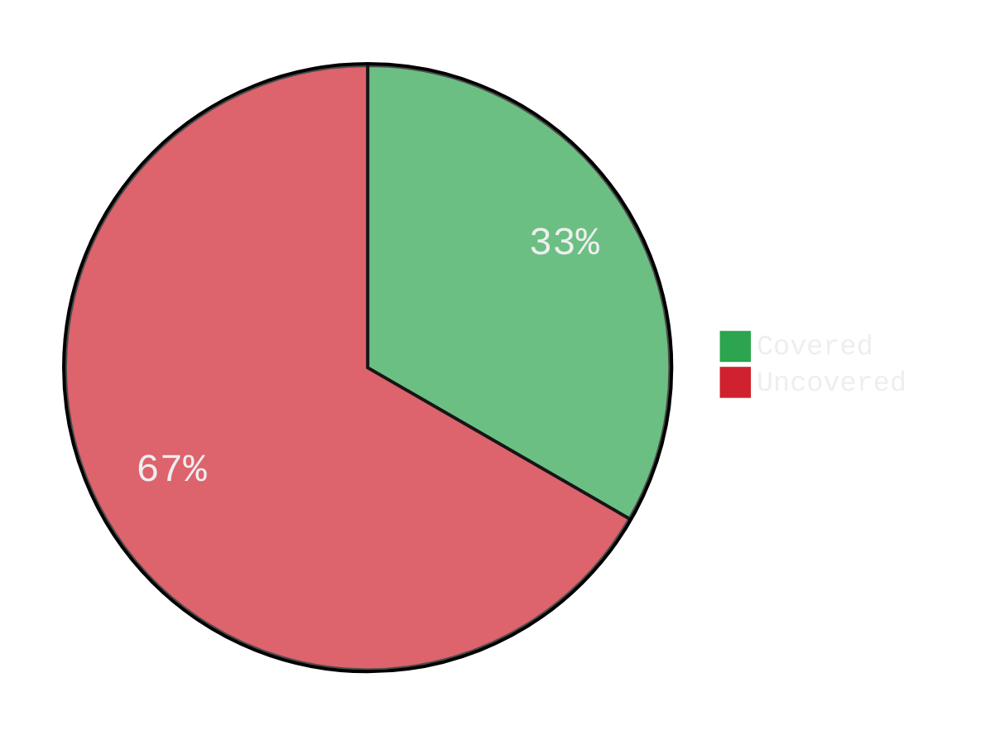
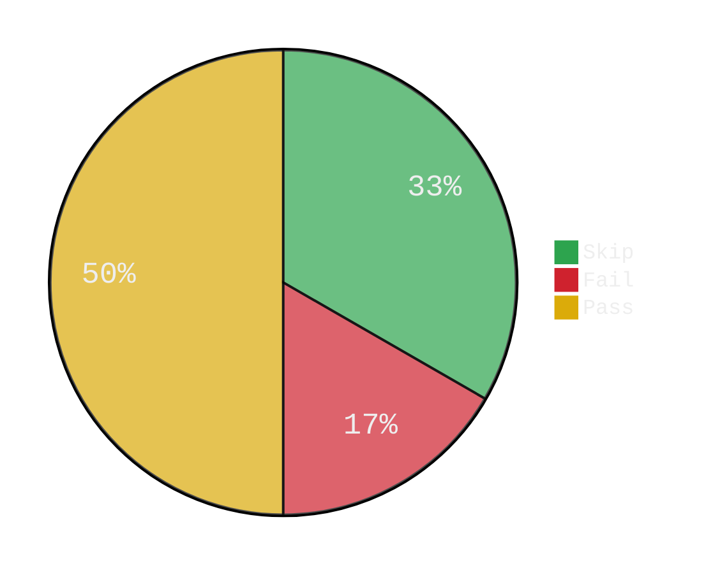

## Lint

{{ if gt (len .Lint.Report.Warnings) 0 }}
Warnings: 

<pre> 
{{ range .Lint.Report.Warnings }}{{.Tag}}: {{.Text}}
{{ end }} 
</pre>

{{ end }}

Issues:
<table>
    <tr>
        <th>Linter</th>
        <th>Issue</th>
        <th>File</th>
        <th>Column</th>
    </tr>
    {{ range .Lint.Issues }}<tr>
        <td>{{ .FromLinter }}</td>
        <td>{{ .Text }}</td>
        <td>{{ .Pos.Filename }}</td>
        <td>{{ .Pos.Line }}:{{ .Pos.Column }}</td>
    </tr>{{ end }}
</table>

## Coverage

## Tests

<table>
    <tr>
        <th>Package</th>
        <th>Passed</th>
        <th>Skipped</th>
        <th>Duration</th>
    </tr>
</table> 