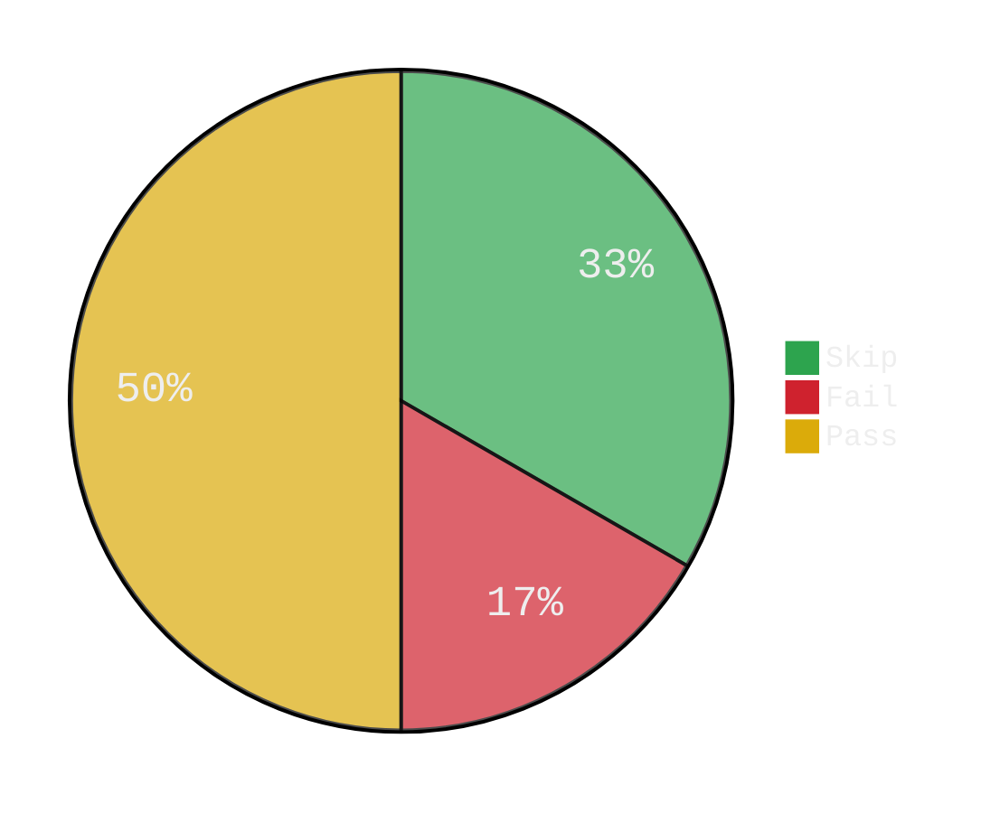

## Lint

{{ if gt (len .Lint.Report.Warnings) 0 }}
Warnings: 

<pre> 
{{ range .Lint.Report.Warnings }}{{.Tag}}: {{.Text}}
{{ end }} 
</pre>

{{ end }}

Issues:
<table>
    <tr>
        <th>Linter</th>
        <th>Issue</th>
        <th>File</th>
        <th>Column</th>
    </tr>
    {{ range .Lint.Issues }}<tr>
        <td>{{ .FromLinter }}</td>
        <td><code>{{ .Text }}</code></td>
        <td>[{{ .Pos.Filename }}:{{ .Pos.Line }}:{{ .Pos.Column }}]({{(link .Pos.Filename .Pos.Line)}})</td> 
    </tr>{{ end }}
</table>

## Coverage
{{ $totalStatements := .TotalCoverage.Statements }}
{{ $totalCovered := .TotalCoverage.Covered }}
{{ $totalCoverage := (percent $totalCovered $totalStatements) }}

<table>
<tr>
    <th>📦 Package</th>
    <th>Coverage</th> 
</tr>
{{- range $key, $value := .PackageCoverage }}
{{if ne $key "*"}}
<tr>
    <td>{{$key}}</td>
{{ $totalStatements := .Statements }}
{{ $totalCovered := .Covered }}
{{ $totalCoverage := printf "%.2f%%" (percent $totalCovered $totalStatements) }}
<td>{{$totalCoverage}}</td>
</tr> 
{{end}}
{{- end}}
</table>

## Tests

<table>
    <tr>
        <th>Package</th>
        <th>Passed</th>
        <th>Skipped</th>
        <th>Duration</th>
    </tr>
</table> 