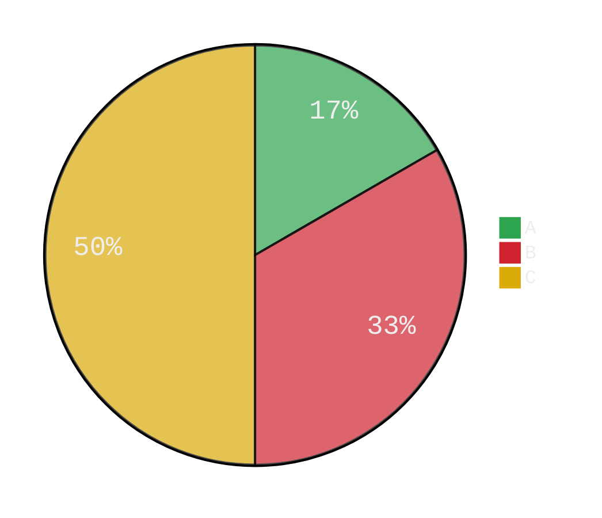

## It

## Works

```mermaid
%%{init: {"theme":"base","themeVariables":{"fontFamily":"monospace","pieSectionTextSize":"24px","darkMode":true,"pie1":"#2da44e","pie2":"#cf222e","pie3":"#dbab0a"}}}%%
pie
    "A": 1
    "B": 2
    "C": 3
```

<table>
  <tr>
    <th>Header 1</th>
    <th>Header 2</th>
  </tr>
    <tr>
        <td>Row 1, Col 1</td>
        <td>Row 1, Col 2</td>
    </tr>
</table>